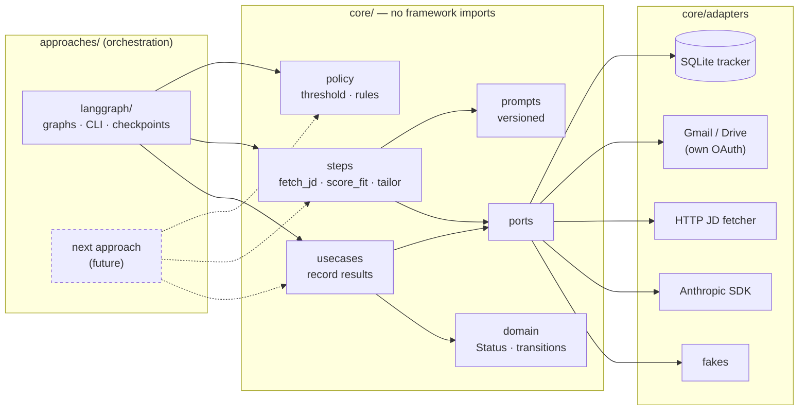
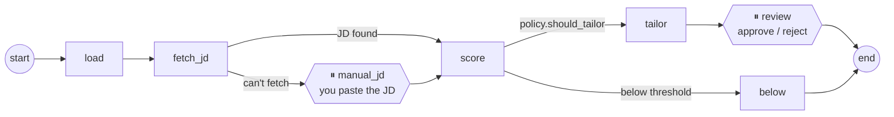

# Job-search orchestration

A working pipeline that runs my own job search, and a worked example of how I'd structure an agentic workflow for a client: business logic in one framework-free package, orchestration in replaceable approaches, evals in CI, and a migration path from the version already in production.

**Setup:** [docs/setup/job-search-langgraph.md](../../docs/setup/job-search-langgraph.md) · **Why it's built this way:** [ADR 0001](../../docs/adr/0001-orchestration-approach.md), [ADR 0002](../../docs/adr/0002-tracker-is-system-of-record.md)

```bash
uv sync --all-packages && uv run jobs demo     # see it work with fakes, no keys needed
```

## What it does

1. **Intake:** find job leads in Gmail and screen them quickly. *(roadmap M2)*
2. **Evaluate:** fetch the full job description, score fit 1–10 against my master resume, and name the top three gaps. *(this PR)*
3. **Tailor:** for scores of 7 or more, draft a tailored resume and pause for my review. Re-tailor unsubmitted resumes when the master resume changes. *(tailor + review: this PR; refresh: M5)*
4. **Track:** follow each job through submission, interviews, and outcome, and notice when postings close. *(manual commands: this PR; automated sweep: M3)*

## Architecture



**The evaluate graph.** Each job runs on its own checkpointed thread (`thread_id = job_id`):



### Rules the structure enforces

- **`core` never imports an orchestration framework.** [`test_import_boundary.py`](core/tests/test_import_boundary.py) fails CI if it does.
- **Routing decisions live in `core.policy`.** Graph edges only call the rules; they never re-implement them.
- **Status changes go through `tracker.transition()`.** It rejects illegal moves (for example, `below_threshold → submitted`) and records who made each change.
- **Steps that need a person return `NeedsHuman`.** Core doesn't decide how to wait: LangGraph uses `interrupt()`, and another approach can choose its own way.
- **No personal data in the repo.** `data/` is gitignored, and evals use a synthetic candidate.

## Layout

```
orchestration/job-search/
├── core/                       job_search_core — the business logic
│   ├── src/job_search_core/
│   │   ├── domain.py           Job, FitResult, Status, legal transitions
│   │   ├── policy.py           FIT_THRESHOLD, should_tailor, is_resume_stale, ...
│   │   ├── steps.py            fetch_jd, score_fit, tailor_resume
│   │   ├── usecases.py         record each result in the tracker
│   │   ├── ports.py            interfaces the steps depend on
│   │   ├── prompts/            versioned prompt files
│   │   └── adapters/           sqlite tracker, HTTP fetcher, Anthropic, Gmail, Google auth, fakes
│   └── tests/
├── approaches/
│   └── langgraph/              job_search_langgraph — graphs, CLI (`jobs`), Studio entry
├── evals/job-fit/              synthetic persona + 8 labeled JDs; scoring-band checks
└── data/                       gitignored: your resume, tracker.db, checkpoints, OAuth token
```

## Roadmap

| Milestone | Scope | Status |
|---|---|---|
| M1 | Core + evaluate graph + CLI + evals + CI + setup guide | ✅ this PR |
| M2 | Intake graph (Gmail), read-only import of the Excel tracker, **shadow mode** alongside the Claude skills | next |
| M3 | Status sweep: posting-closed checks, classify recruiter emails (confirmation, interview, rejection) | |
| M4 | `.docx` resume rendering, scheduled runs, per-call LLM tracing | |
| M5 | Refresh graph: re-tailor unsubmitted resumes when the master resume changes | |
| Later | Second approach as a spike (orchestrator–worker) against the same core and evals | |

## Development

```bash
uv sync --all-packages
uv run pytest -q                                  # unit + graph tests, all fakes
uv run ruff check . && uv run ruff format --check .
uv run python evals/job-fit/run_evals.py          # real model; needs ANTHROPIC_API_KEY
```
